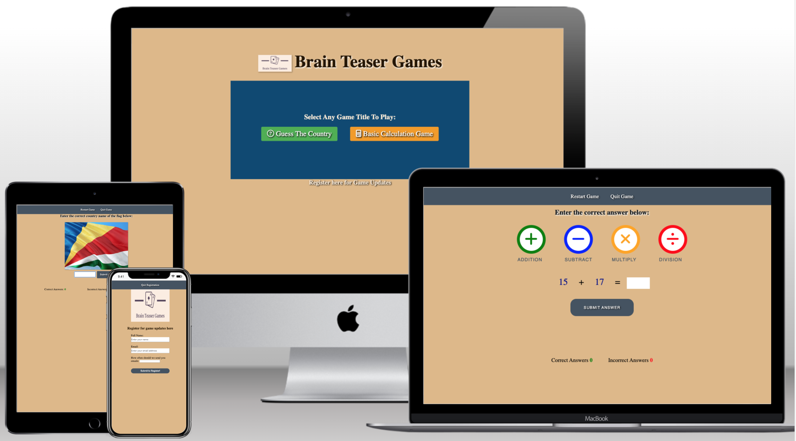
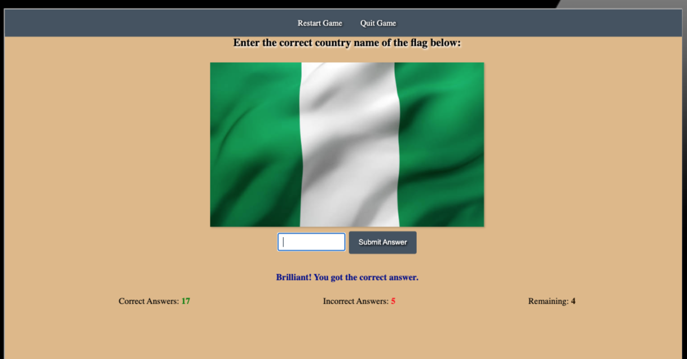
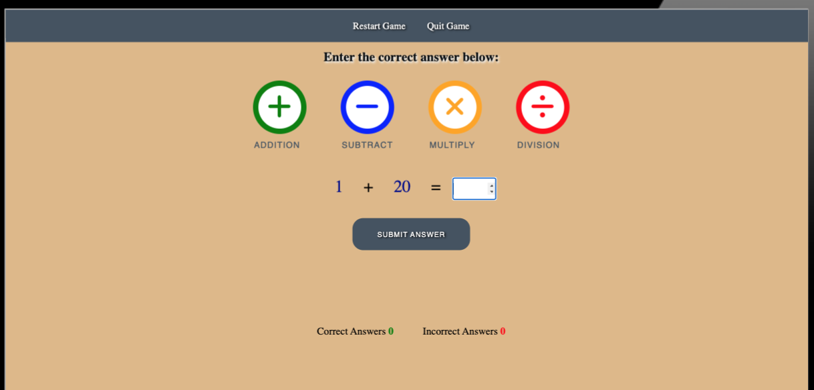
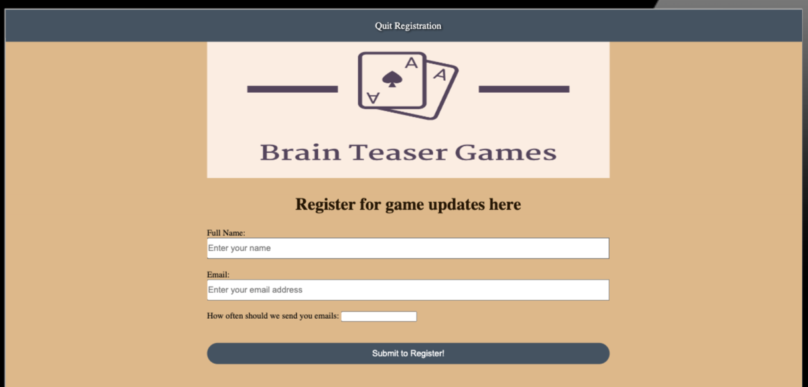

# Brain Teaser Games


**Table of Contents**

- [Introduction](introduction)
- [Features](#features)
- [Game Updates](#game-updates)
- [Future Games](#future-games)
- [Usage](#usage)
- [Testing the App](#testing-the-app)
- [Troubleshooting](#troubleshooting)
- [Future Development](#future-development)
- [Credits](#credits)
- [Contributing](#contributing)
- [Licensing](#licensing)

# Introduction

Brain Teaser Games is a web-based application designed for users of all ages to test their knowledge of country flags and basic math calculations. The app currently offers two exciting games: "Flag Quiz" and "Love Math." It aims to provide an enjoyable and educational experience to players. The app was built using `html`, `css`, and `javascript`. The app has gone through testing and debugging stages.



# Features

## Flag Quiz



The "Flag Game" is an engaging and educational game designed to challenge your knowledge of country flags from around the world. Whether you're a geography enthusiast or just looking to learn something new, this game offers an enjoyable way to test your flag recognition skills.

### How it works

- The Flag Quiz game challenges users to identify the country associated with a displayed flag.
- The game consists of 25 questions, testing the player's knowledge of flags from around the world.
- On every incorrect answer provided, the game automatically informs the user of their input and the correct answer to the particular question.
  
- At the end of the quiz, the user will be scored and the app will provide feedback on user performance based on how many questions the user answered right or wrong.
- If the user scores 20 or more, the game reports a Pass.
  
- If user scores below 20, the game reports a Fail.
  
- There is a Restart Game option for users to start all over at any point in the game
- There is also a Quit Game option for users to quit and return to the Games Homepage at any point in the game
- At the end of the quiz, A **Click OK to Restart Game** message is displayed on the screen to ask users if they would like play again.
  

### Flag Game Error Handling

- The flag game displays a message that disappears after a 2 second period for each time the user enters an answer
- The message displayed informs the user if their answer was right or wrong
- If user answer is correct, it says **"congrats you got the answer"**
- If user answer is wrong, it says sorry your answer was wrong, then it displays the correct answer
- If user enters an integer or any other character type rather than an alphabetical answer, the game informs the user to enter an alphabetical answer
- If user enters a space bar or no answer at all, the game informs the user to enter a valid answer

## Math Game



The "Math Game" is an exciting and interactive way to sharpen your arithmetic skills. This game challenges you with a series of math problems, including addition, subtraction, and multiplication. Whether you're a math enthusiast or looking to enhance your mathematical abilities, this game offers a fun way to practice your skills.

### How it works

- This game offers 10 questions on each round and shuffles questions between different math operators namely Addition, Subtraction and Multiplication. Challenge yourself with increasingly complex problems as you progress.
- User objective is to solve the math problems as accurately as possible, accumulating points with each correct answer. It's a fantastic way to not only enhance your math skills but also compete with yourself to achieve higher scores.
- The game provides feedback on every question answered. If user answers a question correctly, the game informs the user the correct answer has been supplied and if the user gets a question wrong, the game provides feedback with the correct answer.
  

- If user scores 6 out of 10 questions, the game informs the user they passed and ask if they would like to restart the game or quit the game
  
- If user scores below 6, the game instructs the user they failed and also ask if they would like to restart the game or quit the game.
  
- There is a Restart Game option for users to start all over at any point in the game
- There is also a Quit Game option for users to quit and return to the Games Homepage at any point in the game
- At the end of the Math Game, A **Choose OK to Restart Game or Cancel to Quit** message is displayed on the screen to ask users if they would like play again.
  
- The game is designed to help users improve user's math skills while having fun.

### Math Game Error Handling

- The Math game displays a message that disappears after a 2 second period for each time the user enters an answer
- The message displayed informs the user if their answer was right or wrong
- If user answer is correct, it says **"Brilliant! you got the answer"**
- If user answer is wrong, it says **"Aww..sorry your answer was wrong"**, then it displays the correct answer
- If user enters a space bar, an invalid character that is not an integer like "-" or "." or no answer at all, the game informs the user to enter a valid input.
- The game however allows a user to enter a minus or a dot with an integer e.g -10 or .10 and then provides feedback if the user answer is correct or incorrect.
- The game prevents the user from manually selecting an operand type and all questions are automatically randomly generated with random operand types.

## Registration



The game has a register/signup page where users can sign up to receive game updates and activities. The register page has been made very simple and straight-forward so that users can fill up their details in very little time.

## Upcoming Update for Flag Game

- We are working on updating the flag game to include a 4 option answers a user can select from rather than typing out the quiz answer by themselves. We hope that users can get a more enjoyable experience while interacting with the game app once this update has been released.

## Upcoming Update for Math Game

- We are also working on setting difficulty level to the maths game so that users can choose difficulty levels between beginner, intermediate and professional Math levels.

## Future Upcoming Games

In the future, we plan to expand the Brain Teaser Games app by adding more exciting games. Some of the upcoming games include:

- Spelling Game: Test your spelling skills by guessing the correct spelling of words.
- Word Meaning: Guess the meaning of various words and learn new vocabulary.
- Guess the Brand Name: Identify famous brands based on their logos or descriptions.
- Fill in the Gap: Complete sentences by filling in the missing words.
- And lots more..

## Usage

### Running the App Locally

To run the Brain Teaser Games app locally for development and testing purposes, follow these steps:

1. Clone the repository:

   ```bash
    git clone <https://github.com/irishcoders/memory-games.git>
   ```

   Alternatively, you can download the ZIP file and extract it to your local machine.

2. Navigate to the project directory:

   ```bash
    cd memory-games
   ```

3. Install dependencies:
   `npm install`

4. Start the development server:

   ```sql
   npm start
   ```

5. Once the server is running, open your web browser, and visit `http://localhost:3000` to access the app.

## Testing the App

This will execute the test suite and provide feedback on the app's functionality.

## Troubleshooting

### Common Debugging Errors

While running the Brain Teaser Games app, you might encounter some common debugging errors. Below is an example of a potential issue and its solution:

- Null Reference Error

**Error Description:** This error occurs when the code attempts to access a property or call a method on an object that is null or undefined.
**Example:**

```javascript
function updateScore() {
  // Get the score element from the DOM
  var scoreElement = document.getElementById("score");

  // Update the score text
  scoreElement.textContent = score;
}
```

**Solution:** To avoid this error, it's essential to check if the element exists before accessing its properties or calling methods on it.

**Updated Code:**

```javascript
function updateScore() {
  // Get the score element from the DOM
  var scoreElement = document.getElementById("score");

  // Check if the element exists before updating the score
  if (scoreElement) {
    scoreElement.textContent = score;
  } else {
    console.error("Score element not found!");
  }
}
```

By following the above fix, the code will handle the situation where the element with the ID "score" is not found in the HTML document, preventing the Null Reference Error.

### Other Debugging processes

The app `html` and `ccs` code has been tested using The W3C Mark Up Validator (<https://validator.w3.org/nu/#textarea>) and The W3C CSS Validator (<https://jigsaw.w3.org/css-validator/validator>). A LightHouse test has also been carried out during the debugging phase of the app development.

### Unfixed Bugs

- The Math Game media query needs resizing on smaller device. Still in the process of resolving and will be fixed in the next game update.
- LightHouse reports 68% for Math Game accesibility and this will be fixed in the next game update.

## Future Development

We are excited to expand the app's game collection and enhance the user experience. The upcoming games will offer diverse challenges and learning opportunities. We also plan to create a mobile app version to make Brain Teaser Games easily accessible on smartphones and tablets.

## Credits

We would like to give credit to the following sources:

- Unsplash (<https://www.unsplash.com>) and Pexels (<https://pexels.com>) for providing the images used in the project.

- Code Institute's Love Math project, which served as the inspiration for the math game in our app.

- Adam Khoury Javascript Youtube tutorial (<https://youtu.be/tLxBwSL3lPQ>) for teaching us how to use the Fisher-Yates algorithm to shuffle an array, which was helpful in building certain game components.

- PythonTutor for testing all the code before pasting them in VSCode

- Google searches for learning more about iteration and building complex javascript in the DOM.

## Contributing

At the moment, this project is the second assignment project for me, Oluwaseyi Babalola under the full stack web development program at Code Institute. As such, we are not accepting external contributions at this time.

However, we appreciate your interest in the project, and if you have any suggestions or feedback, feel free to reach out to us

## Licensing

This project is the second project in my Full Stack Web Development program and this app is developed to be submitted as my javascript project at (CodeInstitute.com)
