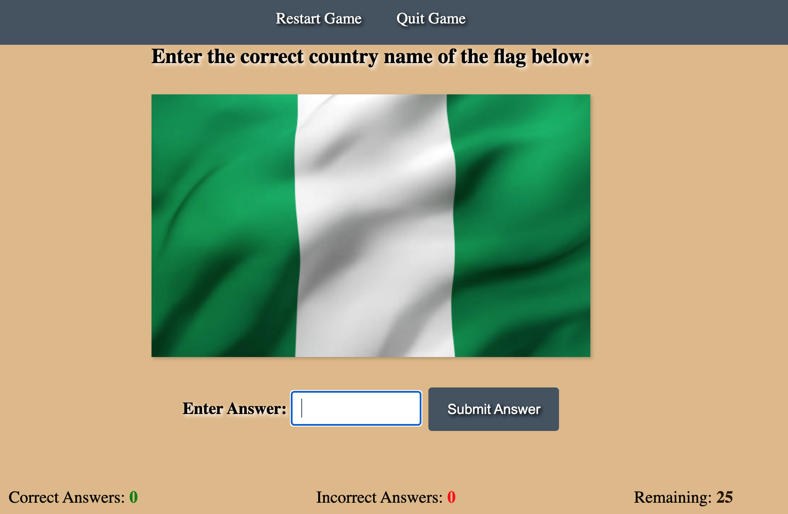

# Brain Teaser Games


**Table of Contents**

- [Introduction](introduction)
- [Features](#features)
- [Game Updates](#game-updates)
- [Future Games](#future-games)
- [Usage](#usage)
- [Testing the App](#testing-the-app)
- [Troubleshooting](#troubleshooting)
- [Future Development](#future-development)
- [Credits](#credits)
- [Contributing](#contributing)
- [Licensing](#licensing)

# Introduction

Brain Teaser Games is a web-based application designed for users of all ages to test their knowledge of country flags and basic math calculations. The app currently offers two exciting games: "Flag Quiz" and "Love Math." It aims to provide an enjoyable and educational experience to players. The app was built using `html`, `css`, and `javascript`. The app also features a registration page aimed at getting user's feedback and also to enable seamless notifications of game updates to registered users. This app has gone through testing and debugging stages and it is connstantly being tested to ensure smooth user experience.


# Features

## Flag Quiz

The "Flag Game" is an engaging and educational game designed to challenge your knowledge of country flags from around the world. Whether you're a geography enthusiast or just looking to learn something new, this game offers an enjoyable way to test your flag recognition skills.



### How it works

- The Flag Quiz game challenges users to identify the country associated with a displayed flag.
- The game consists of 25 questions, testing the player's knowledge of flags from around the world.
- On every correct answer provided, the game automatically provides feedback to the user to say **"Brilliant! you got the correct answer"**
  
- On every incorrect answer provided, the game automatically informs the user of their input and the correct answer to the particular question.
  

- At the end of the quiz, the user will be scored and the app will provide feedback on user's performance based on how many questions the user answered right or wrong.
- If the user scores 20 or more, the game reports a Pass.
  
- If user scores below 20, the game reports a Fail.
  
- There is a "Restart Game" option for users to start all over at any point in the game
- There is also a "Quit Game" option for users to quit and return to the Games Homepage at any point in the game.
- At the end of the quiz, A **Click OK to Restart Game** message is displayed on the screen to ask users if they would like play again.
  

### Flag Game Error Handling

- The flag game displays a message that disappears after a 2 second period for each time the user enters an answer
- The message displayed informs the user if their answer was right or wrong
- If user answer is correct, it says **"congrats you got the answer"**
- If user answer is wrong, it says "sorry your answer was wrong", then it displays the correct answer
- If user enters an integer or any other character type rather than an alphabetical answer, the game informs the user to enter an alphabetical answer.
- If user enters a space bar or no answer at all, the game informs the user to enter a valid answer

## Math Game

The "Math Game" is an exciting and interactive way to sharpen your arithmetic skills. This game challenges you with a series of math problems, including addition, subtraction, and multiplication. Whether you're a math enthusiast or looking to enhance your mathematical abilities, this game offers a fun way to practice your skills.


### How it works

- This game offers 10 questions on each round and shuffles questions between different math operators specifically; Addition, Subtraction and Multiplication. Challenge yourself with increasingly complex problems as you progress.
- User objective is to solve the math problems as accurately as possible, accumulating points with each correct answer. It's a fantastic way to not only enhance your math skills but also compete with yourself to achieve higher scores.
- The game provides feedback on every question answered. If user answers a question correctly, the game informs the user the correct answer has been supplied.
  
- if the user gets a question wrong, the game provides feedback with the correct answer.
  
- If user scores 6 or more out of 10 questions, the game informs the user they passed and ask if they would like to restart the game or quit the game
  
- If user scores below 6, the game instructs the user they failed and also ask if they would like to restart the game or quit the game.
  
- There is a Restart Game option for users to start all over at any point in the game
- There is also a Quit Game option for users to quit and return to the Games Homepage at any point in the game
- At the end of the Math Game, A **Choose OK to Restart Game or Cancel to Quit** message is displayed on the screen to ask users if they would like play again.
  
- This game is designed to help users improve user's math skills while having fun.

### Math Game Error Handling

- The Math game displays a message that disappears after a 2 second period for each time the user enters an answer
- The message displayed informs the user if their answer was right or wrong
- If user answer is correct, it says **"Brilliant! you got the answer"**
- If user answer is wrong, it says **"Aww..sorry your answer was wrong"**, then it displays the correct answer
- If user enters a space bar, an invalid character that is not an integer like "-" or "." or no answer at all, the game informs the user to enter a valid input.
- The game however allows a user to enter a minus or a dot with an integer e.g -10 or .10 and then provides feedback if the user answer is correct or incorrect.
- The game prevents the user from manually selecting an operand type and all questions are automatically randomly generated with random operand types.

## App Registration Page


The game app also features a register/signup page where users can sign up to receive game updates and be informed quickly about new activities. The register page has been made very simple and straight-forward so that users can fill up their details in very little time. The registration page also features a feedback form where users can enter a feedback about the game.

## Registration page and Registration Error handling

The app registration page includes the features below;

- Full name: User will be required to enter their full name in this box,
- email address: User are required to enter their email address where they want to receive future notifications about the game
- Email Frequency: Here users are required to select how often they would like to be contacted about the game within a number of option ranging from daily, weekly, forthnightly and monthly
- Feedback form: Although not mandatory, users have the option to enter their feedback about how the game app can be improved
- The Registration page also has a **Quit Registration** option on top of the page for cases where users do not want to continue with registration.

### Registration Error Handling

The game has been tested so that users cannot leave a required field blank and users will not be able to proceed with registration unless all required fields have been supplied with the expected details.

## Upcoming Update for Flag Game

- Work is in progress to update the flag game to include a 4 option answers whereby a user can select the correct answer from a list of options rather than typing out the answer themselves. This will give users a more enjoyable experience while interacting with the game app once this update has been released.

## Upcoming Update for Math Game

- Work is in progress to update the Math game to introduce different difficulty level to the maths game so that users can choose between a preferred range of difficulty level including; beginner, intermediate and professional Math levels.
- Other updates such as more mobile device compatibilities are also in progress.
- In the next update for Math Game, users will be able to manually select the operands (Addition, Subtraction and Multiplication) they wish to interact with.
- The Division operand will also be added to the Math Game in future updates

## Future Upcoming Games

In the near future, the Brain Teaser Games app will be adding more exciting games for users to have a wider range of games to interact with. Some of the upcoming games will/might include:

- Spelling Game: Test your spelling skills by guessing the correct spelling of words.
- Word Meaning: Guess the meaning of various words and learn new vocabulary.
- Guess the Brand Name: Identify famous brands based on their logos or descriptions.
- Fill in the Gap: Complete sentences by filling in the missing words.
- And lots more..

## Technologies and Languages Used

- [Codeanywhere](app.codeanywhere.com) was used as the IDE in the development of this app
- [JavaScript Tutor](https://pythontutor.com/javascript.html#mode=edit) was used to test out the codes on each stages during the development of this app.
- [HTML](https://www.w3schools.com/html/) is the programming language used in writing the structures for several part of the game including the Main homepage, the Flag Game home page, Math Game Home page and the registration page.
- [CSS](https://www.w3schools.com/css/) is the programming language used in the styling of the game app to make it visually appealing in all areas of the app.
- [Javascript](https://www.javascript.com/) is the main programming language used to add interactivity and automation the the Flag Game and the Math Game app
- [Git](https://git-scm.com/) was used to commit and push code during the developement of the App.
- [GitHub](www.github.com) has been used to store the code, images, and other contents and most importantly has been used to deploy the App to the web
- [Pexels](www.pexels.com) was used to gather the images used for the flag game.

## Testing and Debugging during development

Throughout the development of this app, different sections of codes were written and tested in a step-by-step manner using `console.log()` statements, and issues such as indent errors, console errors, global variable problems, DOMContentLoaded errors, functionality errors, styling errors, general structure errors, preloading images error, bugs testing and more were addressed along the way. Here's an overview of how the process went:

### Flag Game Testing

- **Unit Testing:** Individual functions, such as `shuffleArray`, `validateAns`, and score-related functions, were tested independently to ensure they perform as expected.
- **Web browser preview:** Throught out the development stage, the following code `python3 -m http.server` was used to deploy the project to an external web browser for easy preview of the stages of the app development.
- **Image Preloading:** Images were preloaded in the background(browser console) to prevent delays during gameplay. This ensured that all images loaded correctly before the game started.
- **Input Validation:** The game checks user input for validity. If the user enters invalid characters or leaves the answer box empty, an error message is displayed, and the game doesn't proceed until valid input is provided.
- **Gameplay Testing:** The game underwent extensive testing to confirm that it progresses through questions, calculates scores, and displays messages correctly. The correctness of the answers was verified.
- **Score Calculation:** Score calculations were tested to verify that the correct and incorrect scores update accurately for each user responses.
- **Game End Conditions:** The game was tested to determine the conditions under which it would end, and the appropriate messages are displayed based on the user's performance.
- **UI/UX Testing:** The user interface and user experience were tested to ensure that the game is visually appealing and easy to understand. Emphasis was placed on making sure the flag images displayed correctly.
- **Flag Randomization:** The game's randomization of questions from the images displayed was verified to confirm that each game session presents questions in a different order.
- **Restart Game:** After the game ends, a confirmation alert is displayed to allow the user to restart the game. This feature was tested to ensure it resets the game correctly.
- **LightHouse Testing:** The game was tested with LightHouse and below is the result;
  

### Math Game Testing

During the development of the Math Game, thorough testing and debugging were crucial to ensure that the game worked as intended and provided an excellent user experience. Below is a list of the key testing stages:

- **Math Problem Generation:** I extensively tested the math problem generation to make sure it correctly created addition, subtraction, and multiplication questions within the specified number range i.e 1 - 25.
- **Answer Validation:** process was tested to ensure it accurately evaluated user input and compared it to the correct answer.
- **Score Tracking:** I confirmed that the user's score was accurately calculated and displayed. Both the correct and incorrect scores were tested to ensure they updated as expected.
- **Game Flow:** the entire game flow was tested, making sure questions appeared one after another and that the game ended when all questions were answered. Also ensured a restart or cancel message was displayed after each game round ends.
- **Mobile Responsiveness:** As mobile device usage is common, The math game was tested to make sure that the game was responsive and performed well on both desktop and mobile devices.
- **User Interface:** Very close attention was given to the game's visual presentation. The fonts, colors, and alignment to ensure a visually pleasing and user-friendly design was very important and it was ensured.
- **LightHouse Testing:** The Math game was also tested for performance using LightHouse and below is the result:
  

### Debugging During Development

Debugging during the development of the App was very important to eliminate issues and ensure smooth gameplay for users. Common debugging techniques included:

- **Console Logs:** Extensive use of `console.log` statements was employed to trace variable values, function execution, and detect any errors in the code.
- **Error Handling:** Error handling, such as displaying error messages for invalid user input, was used to provide informative feedback to users.
- **Event Listeners:** Event listeners for button clicks and the "Enter" key presses were tested to ensure they triggered the intended actions and functions.
- **Performance Optimization:** Debugging focused on optimizing game performance, such as reducing input problems, ensuring fast image loading, and minimizing code errors.

**Conclusion**
The App was developed with an emphasis on testing and debugging to deliver a reliable and enjoyable user experience.

### Interesting Issues Found

- **_Flag Game:_** When I implemented the space/no-input function Error handling for the Flag Game, I discovered that it affected one of the answers specifically the "south africa" flag answer. The code below;

```Javascript
else if (answer.trim() === "") {
        error.innerHTML = "Invalid Input. Please enter an answer.";
        return false;
```

- I couldn't find another solution to handle this situation without causing more bugs or error in the overall code so I had to remove this particular question and replaced it with an answer that doesn't require a space.

**_Math Game:_** When I implented the function to set a timer for the display message and restart button for the game, a particular bug keeps making the "Incorrect Answer" section record old incorrect result into new game sessions after user confirms they want to restart game. I had to implement another method by resetting the old incorrect score variable as below;

```javascript
    setTimeout(function () {
            const restart = confirm("Choose 'OK' to Restart or 'Cancel' to Quit Game");
            messageElement.textContent = ""; // Clear the display message immediately

            if (restart) {
                currentQuestion = 0;
                correctAnswers = 0; // Reset the correct score
                incorrectAnswers = initialIncorrectAnswers; // Reset the incorrect score to the initial value
                mathScoreElement.innerText = 0;
                mathIncorrectElement.innerText = initialIncorrectAnswers; // Update the incorrect score display
                totalQuestionsElement.innerText = totalQuestions;
                runGame();
```

## Deployment

### Version Control

Git was used as the version control software. Commands such as git add ., git status, git commit and git push were used to add, save, stage and push the code to the GitHub repository where the source code is stored.

### Running the App Locally

To run the Brain Teaser Games app locally for development and testing purposes, follow these steps:

1. Clone the repository:

   ```bash
    git clone <https://github.com/irishcoders/memory-games.git>
   ```

````

Alternatively, you can download the ZIP file and extract it to your local machine.

2. Navigate to the project directory:

   ```bash
    cd memory-games
   ```

3. Install dependencies:
   `npm install`

4. Start the development server:

   ```sql
   npm start
   ```

5. Once the server is running, open your web browser, and visit `http://localhost:3000` to access the app.

## Testing the App

This will execute the test suite and provide feedback on the app's functionality.

## Troubleshooting

### Common Debugging Errors

While running the Brain Teaser Games app, you might encounter some common debugging errors. Below is an example of a potential issue and its solution:

- Null Reference Error

**Error Description:** This error occurs when the code attempts to access a property or call a method on an object that is null or undefined.
**Example:**

```javascript
function updateScore() {
  // Get the score element from the DOM
  var scoreElement = document.getElementById("score");

  // Update the score text
  scoreElement.textContent = score;
}
```

**Solution:** To avoid this error, it's essential to check if the element exists before accessing its properties or calling methods on it.

**Updated Code:**

```javascript
function updateScore() {
  // Get the score element from the DOM
  var scoreElement = document.getElementById("score");

  // Check if the element exists before updating the score
  if (scoreElement) {
    scoreElement.textContent = score;
  } else {
    console.error("Score element not found!");
  }
}
```

By following the above fix, the code will handle the situation where the element with the ID "score" is not found in the HTML document, preventing the Null Reference Error.

### Other Debugging processes

The app `html` and `ccs` code has been tested using The W3C Mark Up Validator (<https://validator.w3.org/nu/#textarea>) and The W3C CSS Validator (<https://jigsaw.w3.org/css-validator/validator>). A LightHouse test has also been carried out during the debugging phase of the app development.

### Unfixed Bugs

- The Math Game media query needs resizing on smaller device. Still in the process of resolving and will be fixed in the next game update.
- LightHouse reports 68% for Math Game accesibility and this will be fixed in the next game update.

## Future Development

We are excited to expand the app's game collection and enhance the user experience. The upcoming games will offer diverse challenges and learning opportunities. We also plan to create a mobile app version to make Brain Teaser Games easily accessible on smartphones and tablets.

## Credits

We would like to give credit to the following sources:

- Unsplash (<https://www.unsplash.com>) and Pexels (<https://pexels.com>) for providing the images used in the project.

- Code Institute's Love Math project, which served as the inspiration for the math game in our app.

- Adam Khoury Javascript Youtube tutorial (<https://youtu.be/tLxBwSL3lPQ>) for teaching us how to use the Fisher-Yates algorithm to shuffle an array, which was helpful in building certain game components.

- PythonTutor for testing all the code before pasting them in VSCode

- Google searches for learning more about iteration and building complex javascript in the DOM.

## Contributing

At the moment, this project is the second assignment project for me, Oluwaseyi Babalola under the full stack web development program at Code Institute. As such, we are not accepting external contributions at this time.

However, we appreciate your interest in the project, and if you have any suggestions or feedback, feel free to reach out to us

## Licensing

This project is the second project in my Full Stack Web Development program and this app is developed to be submitted as my javascript project at (CodeInstitute.com)
````
